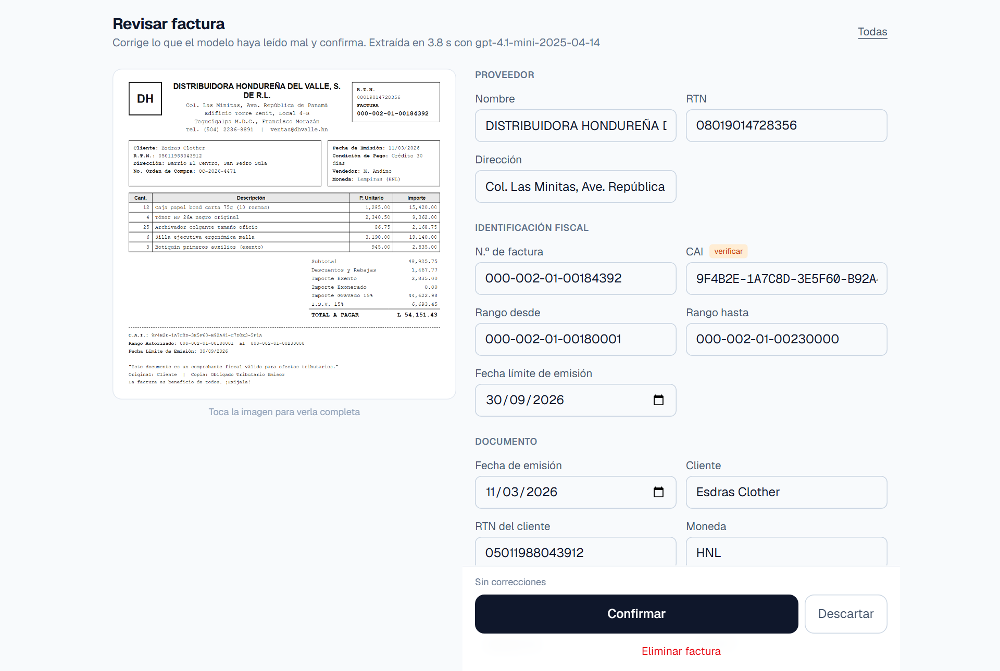
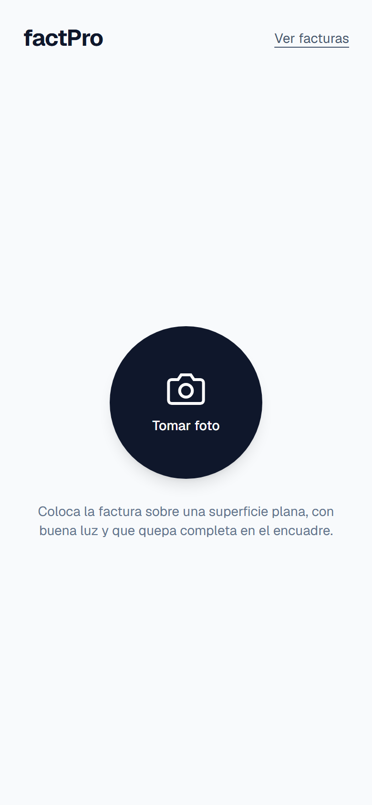
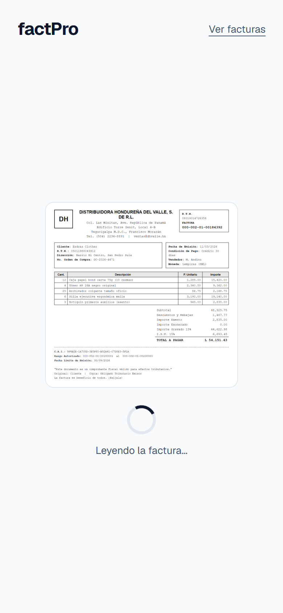
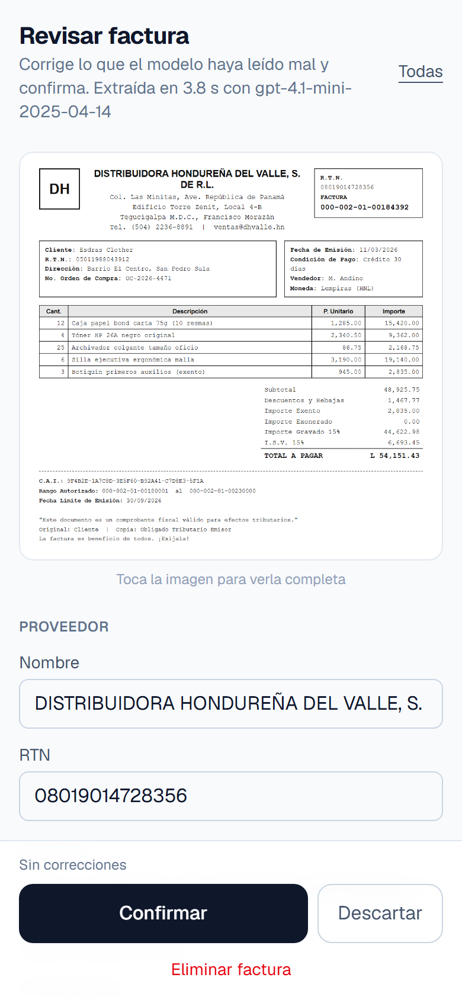
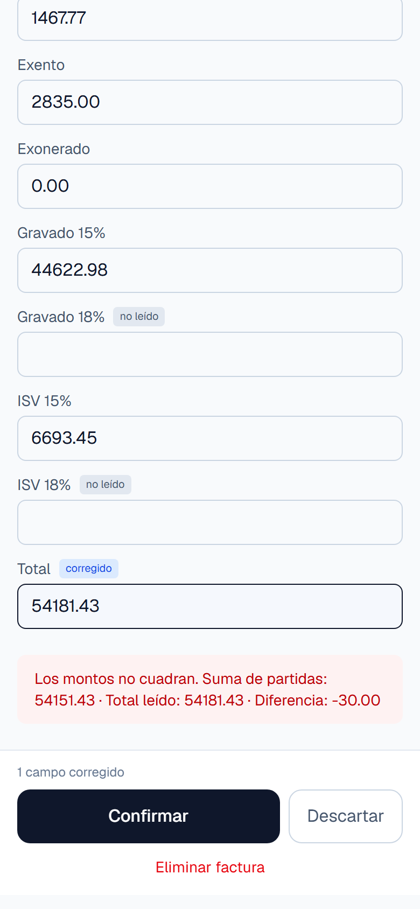
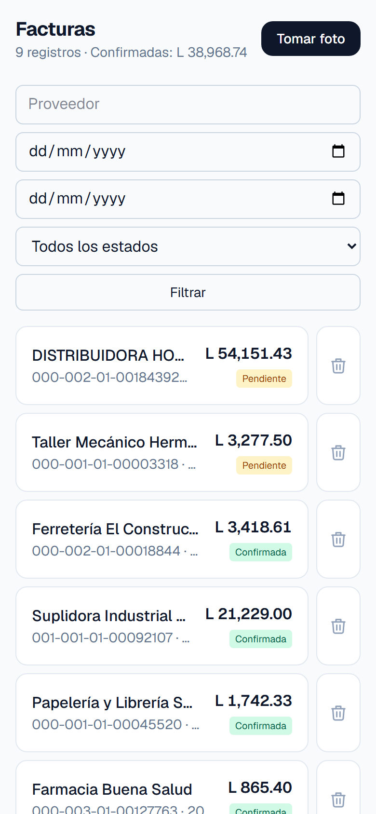
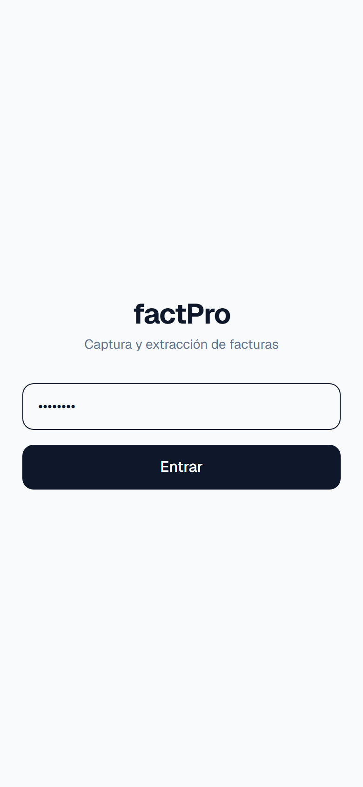
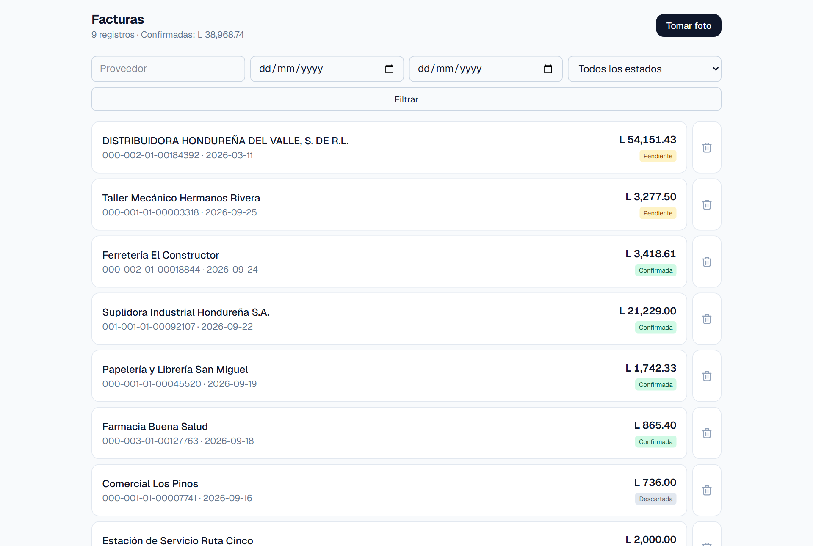

<div align="center">

# factPro

### Fotografía la factura, revisa lo que leyó el modelo y confirma

### [🧾 factpro4.vercel.app](https://factpro4.vercel.app)

[](LICENSE)
[](https://nodejs.org/)
[](https://nextjs.org/)
[](https://neon.com/)

PWA para capturar facturas hondureñas del SAR con la cámara del teléfono y
extraer sus datos fiscales —RTN, CAI, correlativo, rango autorizado, montos e
ISV— con un modelo de visión. Cada factura pasa por una revisión humana, y la
app registra qué campos hubo que corregir.



</div>

## Por qué

Pasar una factura del SAR a una hoja de cálculo es copiar una veintena de
campos a mano, y los que más importan —el CAI, el RTN, el correlativo— son
cadenas largas impresas en letra pequeña. Es justo el trabajo que un modelo de
visión debería hacer bien.

factPro es un **prototipo de validación**: no pretende ser un producto
terminado, sino medir si la extracción automática es lo bastante precisa con
facturas reales. Por eso nunca guarda nada sin que alguien lo revise, y por eso
cuenta cada corrección.

## Qué hace

| | |
| --- | --- |
| **Captura** | Abre la cámara nativa del teléfono y comprime la foto a 1600 px antes de subirla |
| **Extracción** | Un modelo de visión llena 21 campos fiscales; ante la duda devuelve `null`, nunca inventa |
| **Revisión** | La foto queda al lado del formulario para comparar campo por campo |
| **Cuadre aritmético** | Comprueba `exento + exonerado + gravado + ISV = total` mientras editas |
| **Campo a verificar** | El CAI lleva etiqueta y fuente monoespaciada: es el que los modelos más fallan |
| **Duplicados** | La misma factura no entra dos veces: se abre la que ya estaba |
| **Métrica** | Guarda qué campos corrigió el humano; `npm run db:precision` los ordena |
| **Listado** | Filtros por proveedor, fechas y estado, con el total confirmado |
| **Instalable** | PWA con icono propio, pensada para usarse de pie con la factura en la mano |

## Cómo se ve

### Del teléfono a la base

<table>
<tr>
<td width="33%"></td>
<td width="33%"></td>
<td width="33%"></td>
</tr>
<tr>
<td><b>Captura</b> — un botón y la cámara nativa</td>
<td><b>Extracción</b> — entre 3 y 5 segundos</td>
<td><b>Revisión</b> — la foto arriba, los campos abajo</td>
</tr>
</table>

### El cuadre que delata un dígito mal leído

Si el modelo confunde un 5 con un 8 en un monto, la suma deja de cuadrar y la
app lo dice antes de confirmar. Es el detector de errores más barato que hay.

<table>
<tr>
<td width="33%"></td>
<td width="33%"></td>
<td width="33%"></td>
</tr>
<tr>
<td><b>Cuadre</b> — el total corregido ya no suma</td>
<td><b>Facturas</b> — pendientes y confirmadas</td>
<td><b>Acceso</b> — una contraseña compartida</td>
</tr>
</table>



> Las capturas salen de una rama de base de datos con **facturas inventadas**:
> ningún proveedor, RTN ni CAI corresponde a una empresa real.

## El modelo

En producción corre `gpt-4.1-mini`. No se eligió por intuición:
`db/benchmark.mjs` compara modelos contra `fixtures/factura-prueba.png`, una
factura sintética cuyos valores correctos están en el `.esperado.json` de al
lado.

| Modelo | Aciertos | Latencia | Tokens de entrada |
| --- | --- | --- | --- |
| **gpt-4.1-mini** | **19–20 / 20** | 3–5 s | 2013 |
| gpt-5.4-mini | 18 / 20 | 2.7 s | 1800 |
| gpt-4.1 | 18 / 20 | 2.8 s | 1959 |

`gpt-4.1-mini` gana y además es el más barato. Dos hallazgos de esas pruebas:

- **El CAI es el campo frágil.** Con un encuadre mediocre, los cuatro modelos
  probados lo fallaron por uno o dos caracteres. Es hexadecimal y sin dígito
  verificador, así que no hay forma de validarlo por software: la pantalla de
  revisión lo marca con «verificar».
- **Encuadrar bien mejora la precisión y baja el costo a la vez.** Recortar la
  foto a la factura bajó los tokens de entrada de 3178 a 2013 y corrigió
  errores de lectura. De ahí la guía en la pantalla de captura.

El modelo se lee de `EXTRACCION_MODELO`; nunca está fijo en el código. Con
`EXTRACCION_PROVIDER=mock` la app funciona completa sin API key y sin costo.

## Tecnologías

| Área | Tecnología |
| --- | --- |
| Aplicación | Next.js 16 (App Router), React 19, TypeScript |
| Estilos | Tailwind CSS 4 |
| Base de datos | Lakebase Postgres en Neon, con migraciones SQL propias |
| Fotos | Neon Object Storage (bucket privado, URLs prefirmadas) |
| Extracción | Modelo de visión vía API compatible con OpenAI, validado con Zod |
| Sesión | Contraseña compartida y cookie firmada con HMAC |
| Despliegue | Vercel |

## Puesta en marcha

Requisitos: **Node 22+** y una cuenta de **[Neon](https://neon.com/)** con un
proyecto en `us-east-2` (la única región con Object Storage por ahora).

```bash
git clone https://github.com/esdrasclth/factPro4.git
cd factPro4
npm install

npx neonctl link         # elige tu proyecto; escribe .neon y .env.local
npx neonctl deploy       # crea el bucket «facturas» declarado en neon.ts
```

Completa en `.env.local` lo que Neon no llena (la plantilla está en
[`.env.example`](.env.example)):

```bash
APP_PASSWORD=la-que-quieras
EXTRACCION_PROVIDER=mock      # o openai + EXTRACCION_MODELO + OPENAI_API_KEY
```

```bash
npm run db:migrate    # aplica db/migrations/*.sql en orden
npm run dev           # http://localhost:3000
```

Para probar la cámara desde el teléfono, abre la URL de red que imprime
`npm run dev` estando en la misma Wi-Fi.

## Scripts

| Script | Qué hace |
| --- | --- |
| `npm run dev` | Servidor de desarrollo |
| `npm run build` · `npm start` | Compilar y servir |
| `npm run lint` | ESLint |
| `npm run smoke` | Prueba de humo del flujo completo (20 verificaciones), con `EXTRACCION_PROVIDER=mock` |
| `npm run probar-real` | Sube la factura de prueba al modelo real y compara campo por campo |
| `npm run benchmark -- "m1,m2"` | Compara modelos de visión sobre el fixture |
| `npm run db:migrate` · `db:check` | Migraciones y verificación del esquema |
| `npm run db:precision` | **La métrica del prototipo**: qué campos falla más el modelo |
| `npm run db:ultimas` | Últimas facturas y su resultado de extracción |
| `npm run db:limpiar -- --si` | Borra todas las facturas y sus fotos |
| `npm run iconos` | Regenera los iconos de la PWA |

## Cómo se mide el prototipo

Al confirmar una factura, la app guarda en `campos_corregidos` exactamente qué
campos tuvo que arreglar el humano. Después de procesar 10–20 facturas reales:

```bash
npm run db:precision
```

Ese ranking es la decisión: dice si la extracción sirve y qué campos necesitan
mejor prompt o validación.

## Decisiones de diseño que no son obvias

- **Todos los campos extraídos son nullable.** Un null es correcto; un valor
  inventado es el peor error posible en datos fiscales.
- **La foto se guarda antes de extraer.** Si la extracción falla, la captura no
  se pierde: queda la fila vacía para llenarla a mano.
- **Duplicados por `(proveedor_rtn, numero_factura)`.** Es la clave natural de
  una factura. El índice por CAI queda de respaldo, pero no puede ser el
  principal: cuando el CAI sale null, la detección se apagaría en silencio.
- **El cuadre no vuelve a restar el descuento.** En una factura del SAR la
  partición de la base ya viene neta, así que la cuenta es
  `exento + exonerado + gravado + ISV = total`. Sólo el camino alterno, el que
  parte del subtotal bruto, lo resta.
- **Tema claro fijo.** Se usa comparando el formulario contra papel blanco; un
  tema oscuro a medias daría peor contraste justo donde hay cifras pequeñas.
- **`capture="environment"` en vez de `getUserMedia`.** La cámara nativa enfoca
  mejor, da más resolución y se comporta igual en iOS y Android.
- **1600 px antes de subir.** Por debajo se pierden el CAI y los montos, que son
  el texto más pequeño de la factura.

## Estructura

```text
app/
  page.tsx            captura
  facturas/           listado y revisión
  api/                subida, edición, borrado y login
lib/
  extraccion/         prompt, extractor real y mock
  db.ts · storage.ts  Postgres y bucket
db/                   migraciones, benchmark, métricas y pruebas
fixtures/             factura sintética y sus valores esperados
docs/capturas/        imágenes de este README
neon.ts               bucket declarado como código
```

## Pendiente

1. Medir la precisión con facturas reales: el fixture es sintético.
2. Exportar a CSV desde el listado.
3. Pasar de contraseña compartida a cuentas de usuario.

## Contribuir

[`CONTRIBUTING.md`](CONTRIBUTING.md) explica el entorno, cómo probar sin gastar
créditos de IA y qué comprobar antes de un pull request.

## Licencia

**[MIT](LICENSE)**. Úsalo, modifícalo y distribúyelo como quieras.
